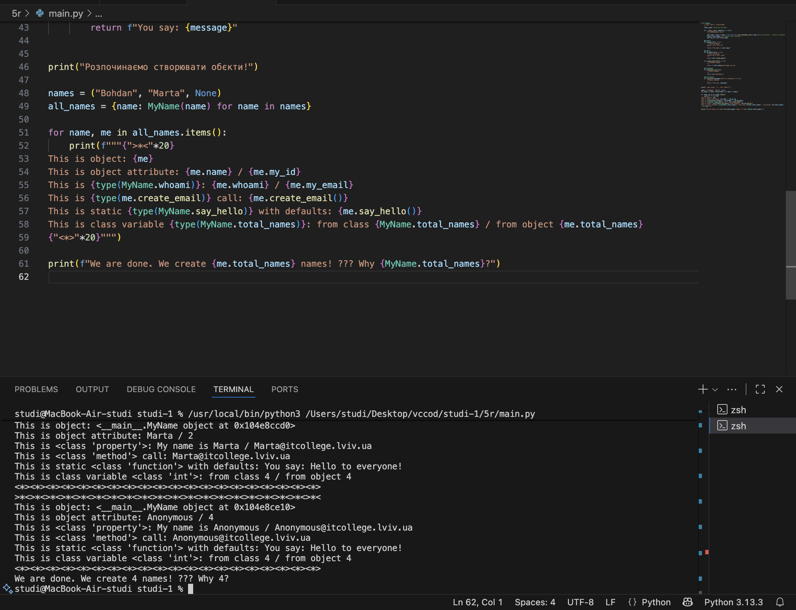
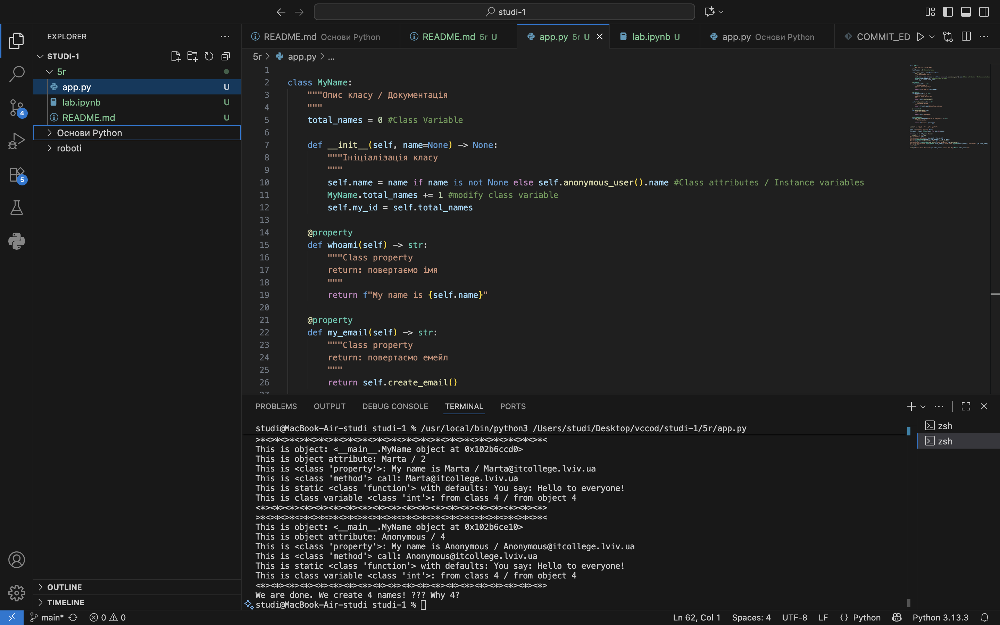

**Звіт до Роботи**

**Тема роботи: Робота з Класами та Обєктами**

**Мета роботи: Навчитись використовувати основні принципи ООП, розглянути кострукції побудови класу та створення обєктів та навчитись працювати з ними** 

**1.Створіть два python файли: для Ноутбука з розширенням .ipynb та для скрипта з розширенням .py;**

**2.Скопіюйте Python код наведений внизу у Ваш файл з розширенням .py та виконайте його натиснувши Run Python File (трикутник ▶️)**


**Виконання роботи**

**1.Скопіюйте Python код наведений внизу у Ваш файл з розширенням .py та виконайте його натиснувши Run Python File (трикутник ▶️)**


**2.Модифікуйте програму додавши своє імя в список;** 

**3.⭐ дайте відповідь на запитання та зробіть індивідуальні завдання:**
***1.Чому коли передаємо значення None створюється обєкт з іменем Anonymous?**
**Коли програма бачить none, вона не може створити користувача з порожнім ім’ям. Тому вона автоматично викликає метод self.anonymous_user()**

**2.Як змінити текст привітання при виклику методу say_hello()? Допишіть цю частину коду.**
```python 
MyName.say_hello("Привіт")
```

**3.Допишіть функцію в класі яка порахує кількість букв імені (підказка: використайте функцію len());**
```python 
def name_length(self):
    **return len(self.name)
```

**4.Порахуйте кількість імен у списку names та порівняйте із виведеним результатом. Дайте відповідь чому маємо різну кількість імен?**
**Тому що коли програма бачить none вона створює анонімного користувача anonymous це додатковий обєкт і потім продовжує створювати звичайний обєкт.**

**5.модифікуйте конструктор init, щоб значення self.name завжди починалося з великої літери, навіть якщо користувач ввів маленьку.;** 
```python 
name = name.capitalize()
```

**6.змініть метод create_email так щоб можна було модифікувати значення після @;**
```python 
def create_email(self, domain="itcollege.lviv.ua"):
    return f"{self.name}@{domain}"
```

**7.додайте перевірку: якщо ім’я містить цифри або символи, підніміть помилку**
```python
if not name.isalpha():
  ValueError("Імя може містити лише літери").
```

**8.додайте нову властивість full_name, яка повертає результат у форматі:**
```python 
@property
def full_name(self):
    return f"User #{self.my_id}: {self.name} ({self.my_email})"

    Результат: FULL: User #2: Marta (Marta@itcollege.lviv.ua) 
```

**9. реалізуйте метод save_to_file(filename="users.txt"), який додає рядок із записом у файл;**
```python
def save_to_file(self, filename="users.txt"):
    with open(filename, "a", encoding="utf-8") as f:
    f.write(self.full_name + "\n")
 ```


