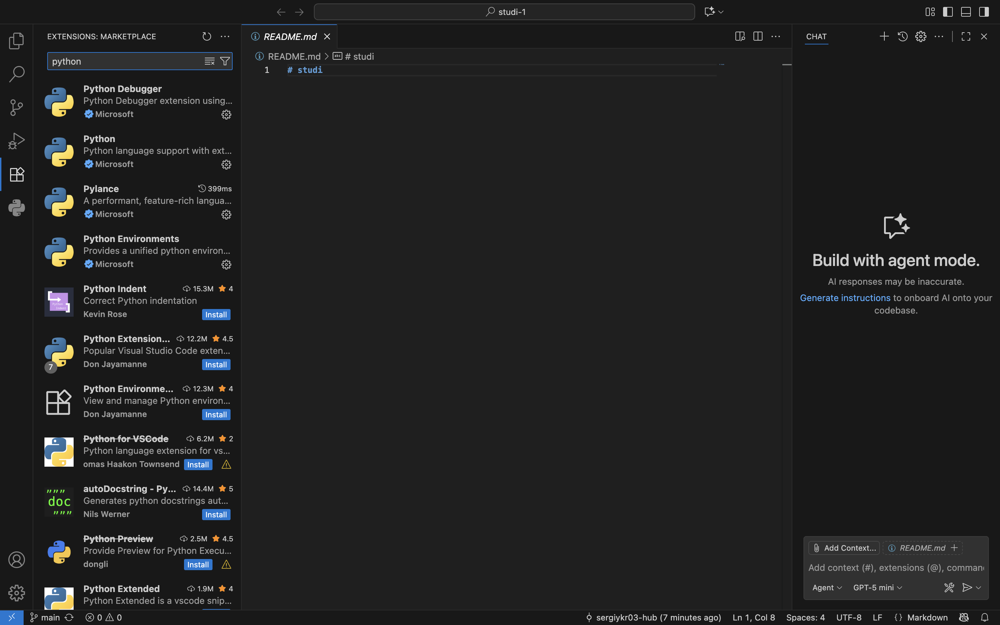
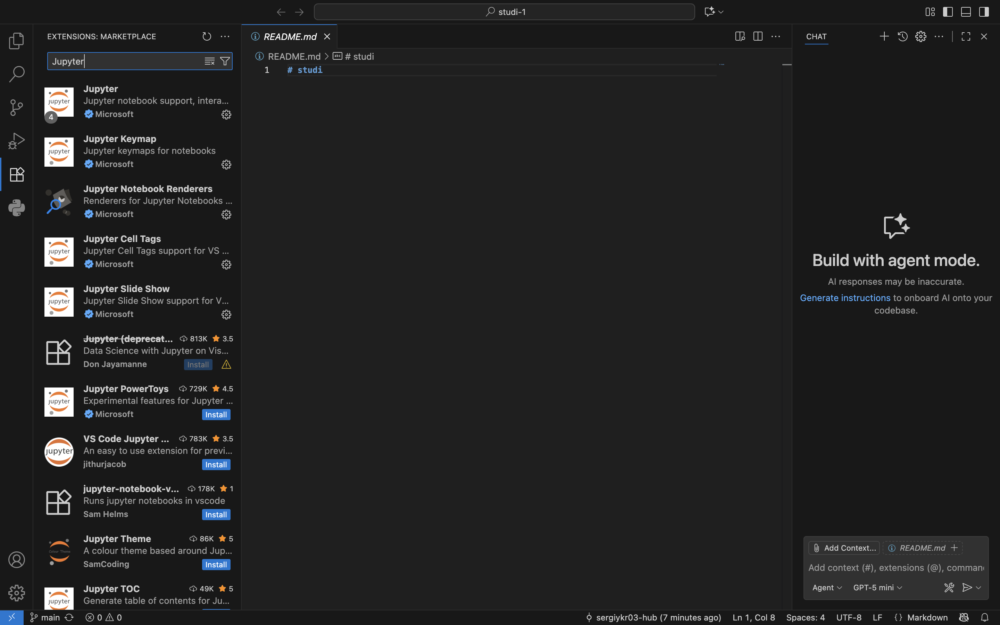
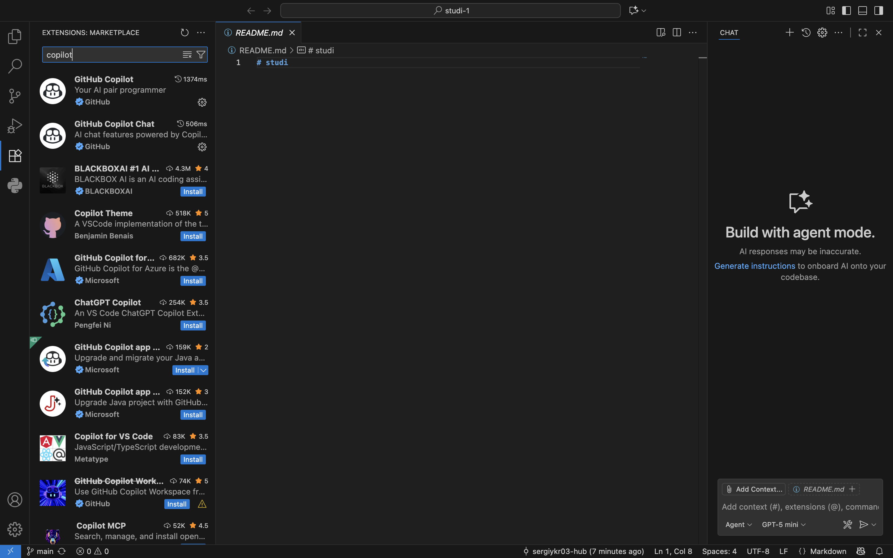
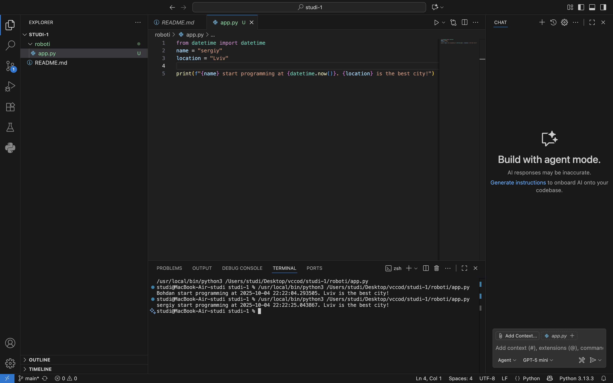
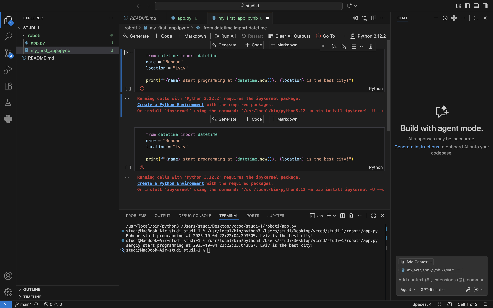

**Звіт до Роботи**

**Тема роботи: Оформлення робіт та перша програма**

**Мета роботи:** 

**1.Виконати всі завдання описані: https://github.com/BobasB/it_college/tree/main/notes/03_results_formatting**

**2.Оформіть звіт роботи згідно шаблону: https://github.com/BobasB/it_college/tree/main/reports**

**Виконання роботи**

**1.Встановлення плагінів VSCode**

**2.Перша програма на Python** 

**3.Програма на Python Notebook** 

**4.Перша програма написана за запитом AI, пояснення його програми** 

**5.Перевірка працездатності коду написаного AI** 

**Висновок**

***Під час виконання роботи було налаштовано середовище розробки VS Code, встановлено необхідні плагіни, створено першу програму на Python у двох форматах (.py та .ipynb), додано пояснення до коду, перевірено запуск програм, зібрано всі файли та завантажено їх у GitHub-репозиторій. Також була отримана відповідь від AI щодо прикладу першої програми та її пояснення, яке було додано до звіту.***

❓ **Відповіді на запитання:**

***1. Чи досягнуто мети роботи?***

***Так, середовище налаштовано, перша програма створена, звіт оформлено***

***2. Які нові знання отримано?***

***Ознайомлення з:***

***базовою структурою проєкту на GitHub;***

***встановленням плагінів у VS Code;***

***запуском Python-програм у VS Code та Jupyter Notebook;***

***використанням Markdown для опису коду;***

***основами роботи з системою контролю версій.***

***3. Чи вдалось відповісти на всі питання задані в ході роботи?
Так, всі кроки виконано згідно з інструкцією.***

***4. Чи вдалося виконати всі завдання?
Так***

***5. Чи виникли складності у виконанні завдання? -***

***6. Чи подобається такий формат здачі роботи (Feedback)?
Так, зручно, що інструкція структурована та покрокова. Формат інтерактивного ноутбука дозволяє одразу бачити результат***

***7. Побажання для покращення (Suggestions): -***