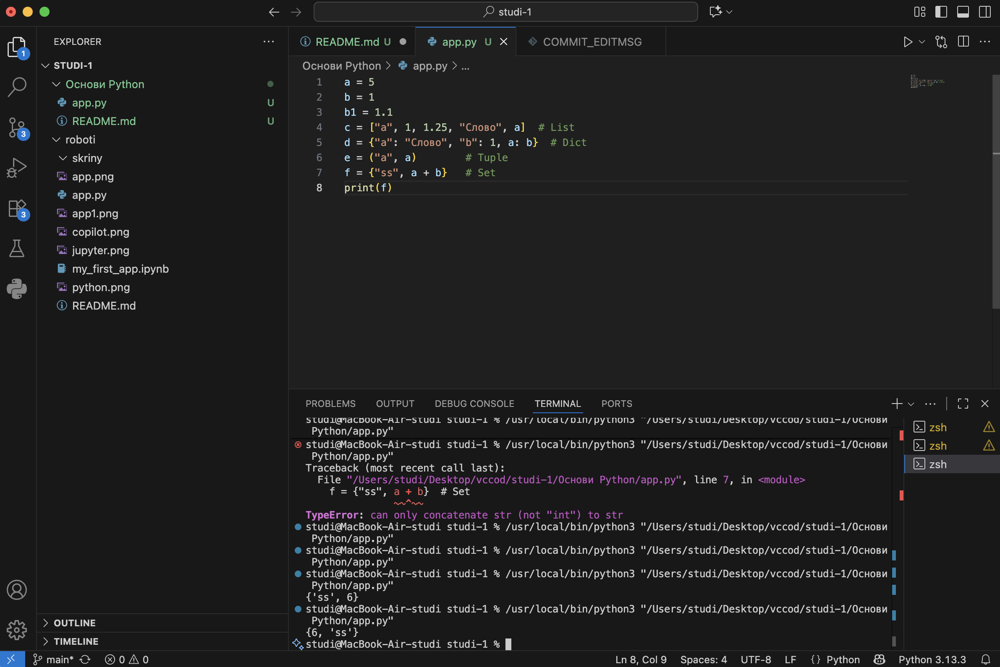
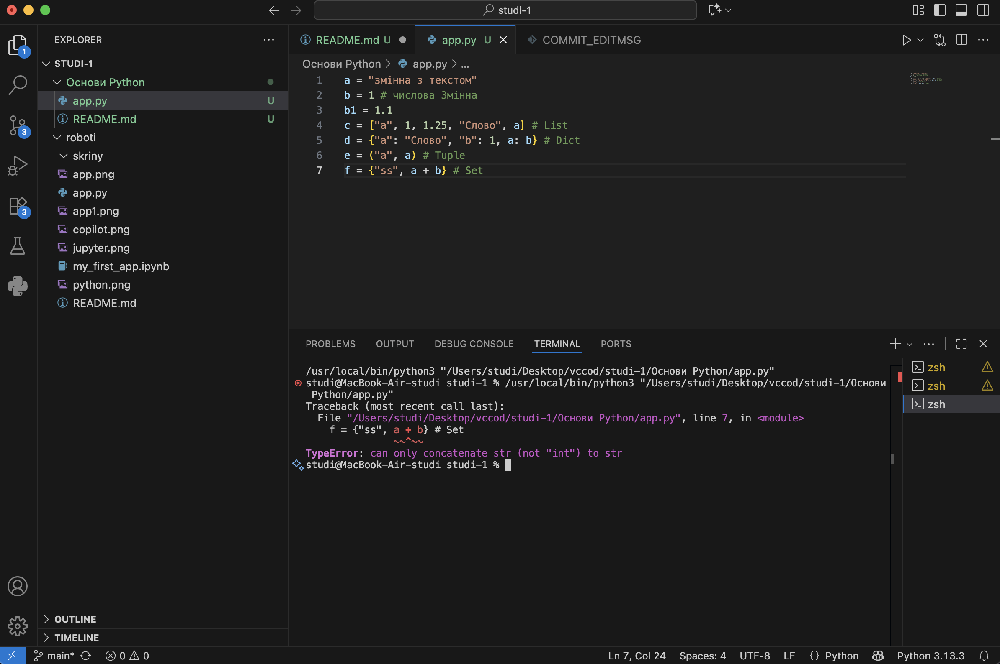
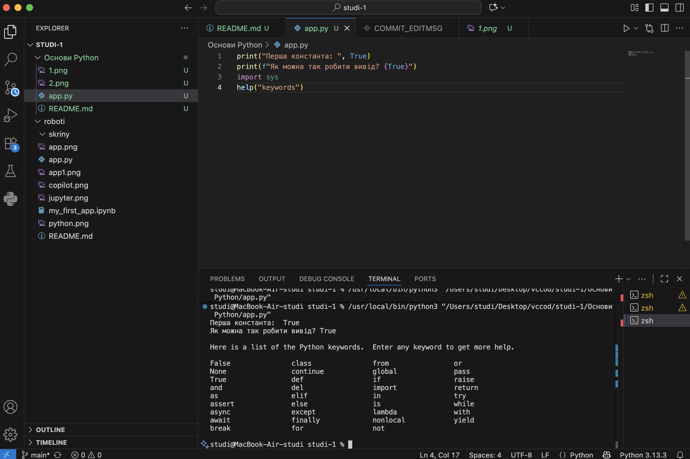
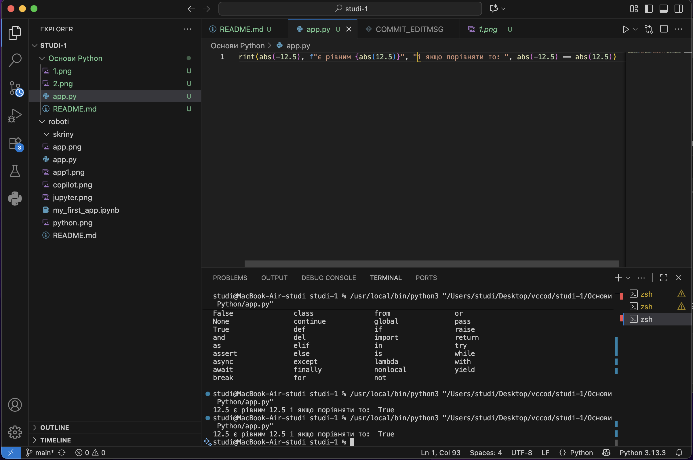
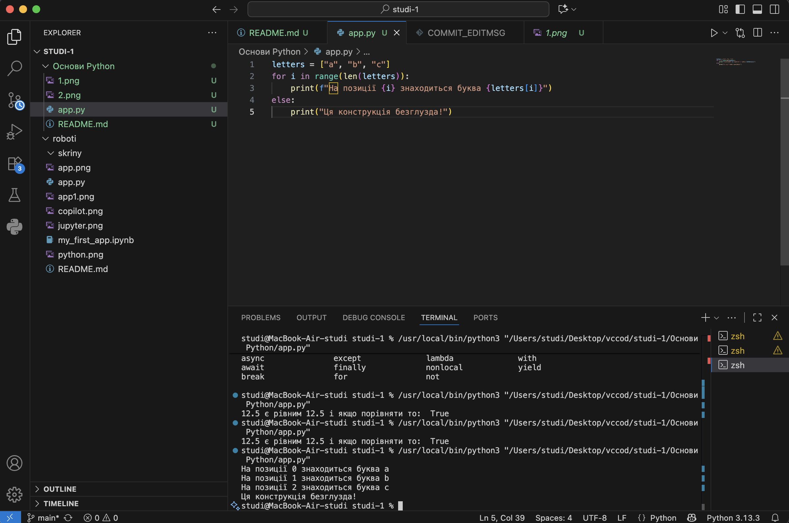
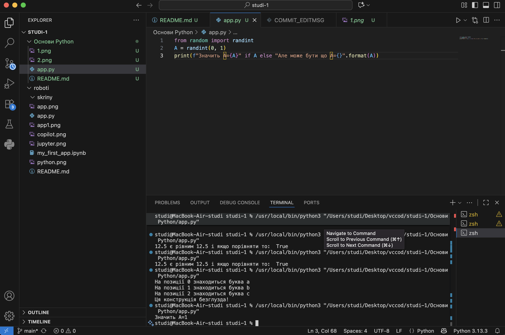
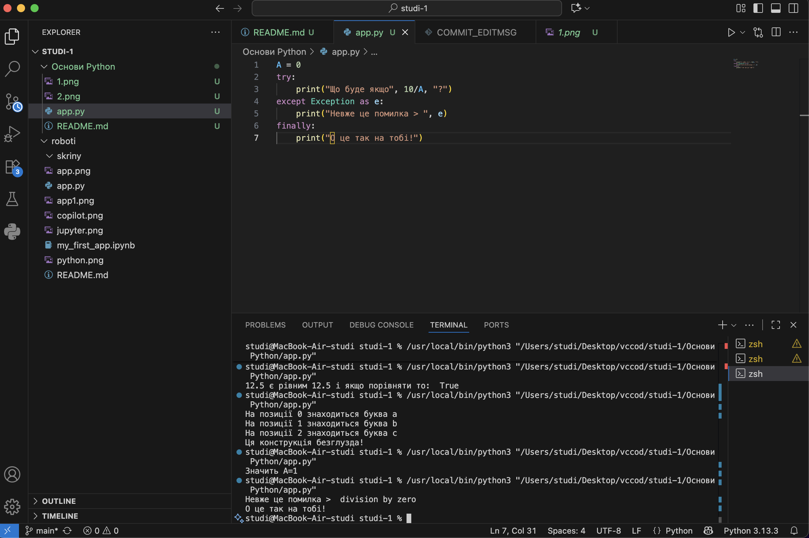
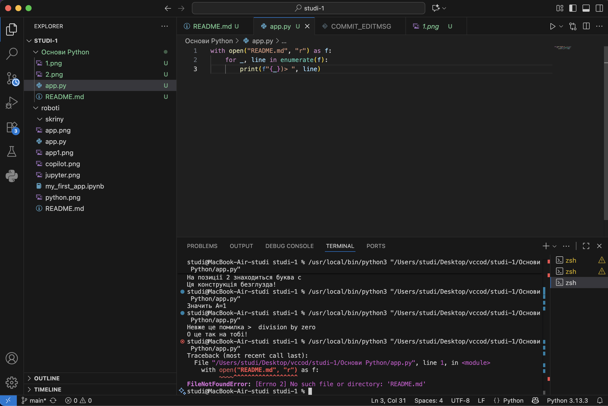
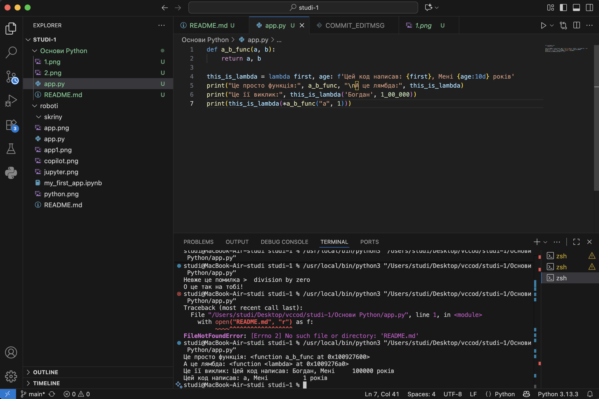
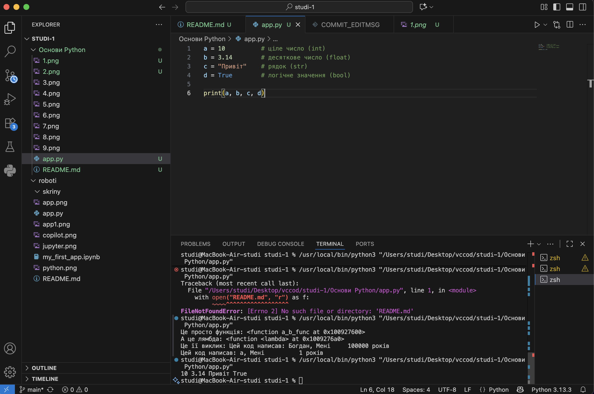

**Звіт до Роботи**

**Тема роботи: Основи Python**

**Мета роботи: Навчитись застосовувати основні конструкції мови Python, виконати всі приклати та з використанням AI створити власні приклади які демонструють особливості кодових конструкцій Pyhton** 

**1. У репозиторії групи (2025_KN*), знайдіть матеріали які виконувались на Лекціях/Лабораторних та виконайте їх;**

**2. Виконайте всі завдання описані https://github.com/BobasB/it_college/tree/main/notes/04_python_basics**

**Виконання роботи**

**1. Створіть Python файл *.py або .ipynb в якому будете виконувати базові приклади. Застосовуючи команду print виконайте наступне:**

**2. Виведіть вбудовані константи, (2-3 на вибір), та зарезервовані слова Python. Наприклад:** 

**3. Виведіть результат роботи вбудованих функцій (2-3 на вибір), наприклад:** 

**4.Познайомтесь з циклами. Напишіть будь-який код який демонструє роботу циклів, (2-3 на вибір), наприклад** 

**5.Познайомтесь з розгалуженнями. Напишіть будь-який код який демонструє роботу розгалужень, (2-3 на вибір), наприклад:** 

**6.Конструкція try->except->finally. У мові Python код не компілюється, а виконується відразу. Можливі помилки нам треба виловлювати самим. Напишіть свій варіант коду з помилкою. Наприклад:** 

**7.Контекст-менеджер with. Можете почитати тут. Напишіть свій код з контекст-менеджером, наприклад:** 

**8.Познайомтесь з Python lambdas. Напишіть свій приклад коду та як Ви розумієте Лямбди, наприклад:** 

**9.Познайомтесь з Python lambdas. Напишіть свій приклад коду та як Ви розумієте Лямбди, наприклад:** 

